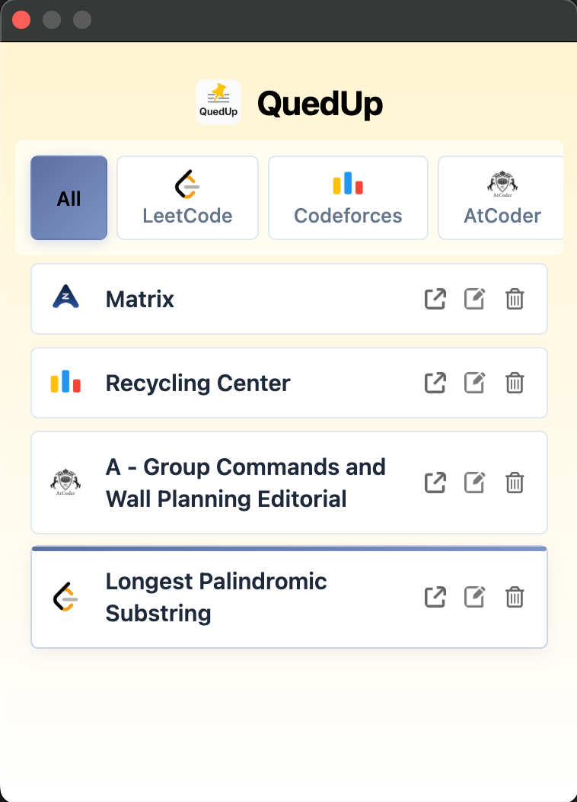
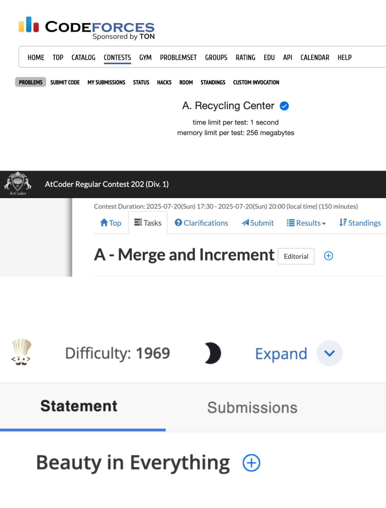
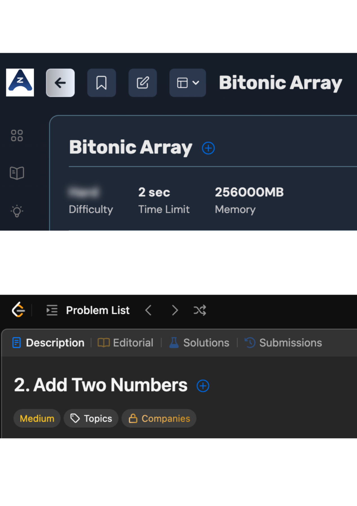

<div align="center" style="display: flex; align-items: center; justify-content: flex-start; gap: 12px;">
  
  <h1 style="margin: 0;">QuedUp - Save Coding Questions Effortlessly</h1>
</div>

[](https://chrome.google.com/webstore/)
[](https://github.com/wasimrehman05/quedup)
[](LICENSE)

> A smart and minimal Chrome extension that lets you save coding problems from different platforms like LeetCode, Codeforces, CodeChef, AtCoder, and Maang.

<!--  -->
<div style="display: flex; gap: 5px; overflow: scroll;">
   
   
   
</div>


## ✨ Features

- **Multi-Platform Support** - Works on LeetCode, Codeforces, CodeChef, AtCoder, and Maang
- **One-Click Bookmarking** - Save problems with a single click
- **Beautiful UI** - Clean, modern interface with smart tab filtering
- **Inline Editing** - Rename problems directly in the popup
- **Cross-Device Sync** - Problems sync across all your Chrome devices
- **Smart Detection** - Automatically detects problem pages

## 🚀 Installation

### Manual Installation (Developer Mode)

1. Clone this repository:
   ```bash
   git clone https://github.com/wasimrehman05/quedup.git
   cd quedup
   ```

2. Open Chrome and navigate to `chrome://extensions/`

3. Enable "Developer mode" in the top right

4. Click "Load unpacked" and select the project folder

5. The extension will be installed and ready to use!

## 💡 How to Use

### Adding Problems
1. Navigate to any supported coding platform
2. Open a problem page  
3. Look for the blue QuedUp button next to the problem title
4. Click the button to save the problem

### Managing Problems
1. Click the QuedUp extension icon in your browser toolbar
2. View all your saved problems in the popup
3. Filter by platform using the tabs
4. Edit, delete, or open problems using the action buttons

## 🛠️ Supported Platforms

- **LeetCode** - `https://leetcode.com/problems/*`
- **Codeforces** - `https://codeforces.com/problemset/problem/*` and contest problems
- **CodeChef** - `https://www.codechef.com/problems/*`
- **AtCoder** - `https://atcoder.jp/contests/*/tasks/*`
- **Maang** - `https://maang.in/*`

## 📄 License

This project is licensed under the MIT License - see the [LICENSE](LICENSE) file for details.

## 👨‍💻 Author

**Wasim Rehman**
- GitHub: [@wasimrehman05](https://github.com/wasimrehman05)

---

⭐ **Star this repository if you found it helpful!** 
